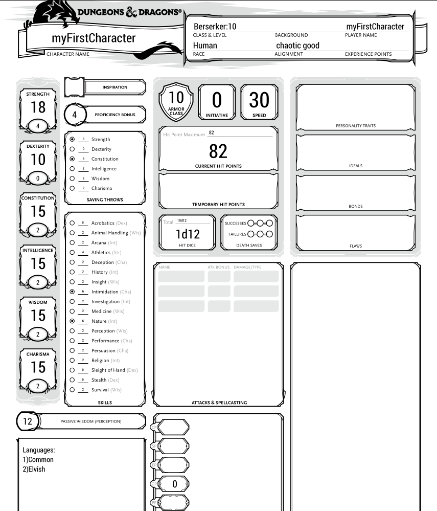

## Create your first character
In order to create your first character you need to:
1. create a new .txt or .ddm file, in this example the file will be named 'singleChar.ddm';
2. the example suppose the following directory content:

        .
        +-- D_Automatic_Charsheet_Compiler.jar
        +-- singleChar.ddm
3. write the following lines inside 'singleChar.ddm':

        create Player myFirstCharacter{
            race: Human
            hp:82
            archetype: (Barbarian->Berserker)
            abilities:(18,10,15,15,15,15)
            alignment:chaotic good
            skills: (Intimidation,Nature)
            languages: (Elvish)
        }
        
        set Level of Barbarian for myFirstCharacter = 10
        
As you can see, using the code above we've defined our first character in DDM named 'myFirstCharacter'.
In order to do it, we've used the key phrase:

        create Player myFirstCharacter 
    
and defined all the 7 mandatory properties of a character:
1. race;
2. hp(hit points);
3. archetype(class with eventual subclass);
4. alignment;
5. skills;
6. languages;
7. abilities, in the following order: (STR,DEX,CON,INT,WIS,CHA);
7. if you don't like the format of the abilities, you can declare the ability score in the
following format:
    
       create Player myFirstCharacter{
                   race: Human
                   hp:82
                   archetype: (Barbarian->Berserker)
                   STR:18
                   DEX:10
                   CON:15
                   CHA:15
                   INT:15
                   WIS:15
                   alignment:chaotic good
                   skills: (Intimidation,Nature)
                   languages: (Elvish)
       }
               
       set Level of Barbarian for myFirstCharacter = 10

As you can see, inside both the ddm file presented, there is also a setting:

    set Level of Barbarian for myFirstCharacter = 10

This setting is the only mandatory one, and is needed to know the class level.

## Result

Using the command

    java -jar D_Automatic_Charsheet_Compiler.jar singleChar.ddm
        
You will obtain the following result:

## Auto completed fields
As you can see in the image above, the following fields are compiled:
1. ability score bonuses;
2. proficiency bonus;
3. saving throws bonuses and  proficiency;
4. armor class;
5. skill bonuses;
6. speed;
7. number of hit dice;
8. 

