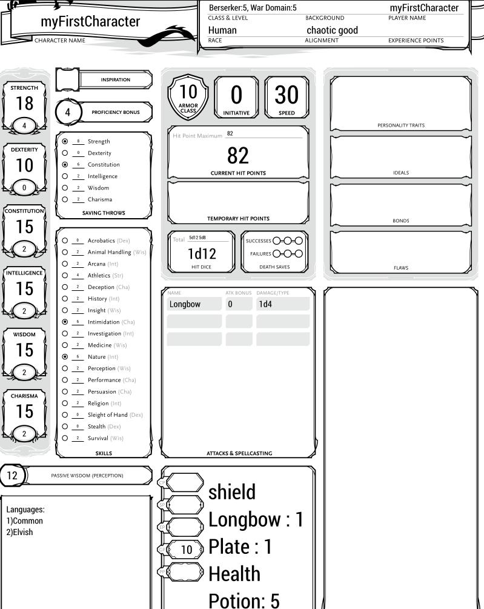
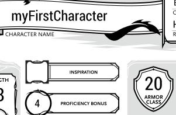

# Create a single equipment
1. [Create your first equipment](#first)
2. [Possible errors](#errors)
## Create your first equipment<a name = "first"/>
To define an equipment, you have to add these lines inside your .ddm file:

        create Equipment heavyEquip{
            armor:Plate
            shield:Yes
            consumables:(Health potion*5)
            weapon:Longbow
        }

As you can see, the code required to create a piece of equipment is similar to what is required to
create a new character. The procedure stars using the key phrase:

        create Equipment <equipName>
        
Inside the equipment definition, there are 4 mandatory fields:
1. armor
2. consumables
3. weapon
4. shield

The first 3 fields admit the key word 'None' in case the equipment does not contain that piece.
The field 'shield' has only 2 possible values: 'Yes' and 'No'.

Using the characters defined by [singleChar.ddm](./SingleChar.md#seconddef), is possibile to add
equipment to a character using the [Items setting](./settings.md#items) to obtain:

As shown in the image above, the armor class is still the same of a character without armor: to show
the actual armor class is necessary the [Active setting](./settings.md#active), in this case the charsheet shows:

## Possible errors<a name = "errors"/>
During the creation of your equipment, the tool can inform you that the .ddm or .txt file contains error.
To know why your file has errors, follow [this link](./errors.md). Remember also that the supported values
of any property are listed [here](./vocab.md).