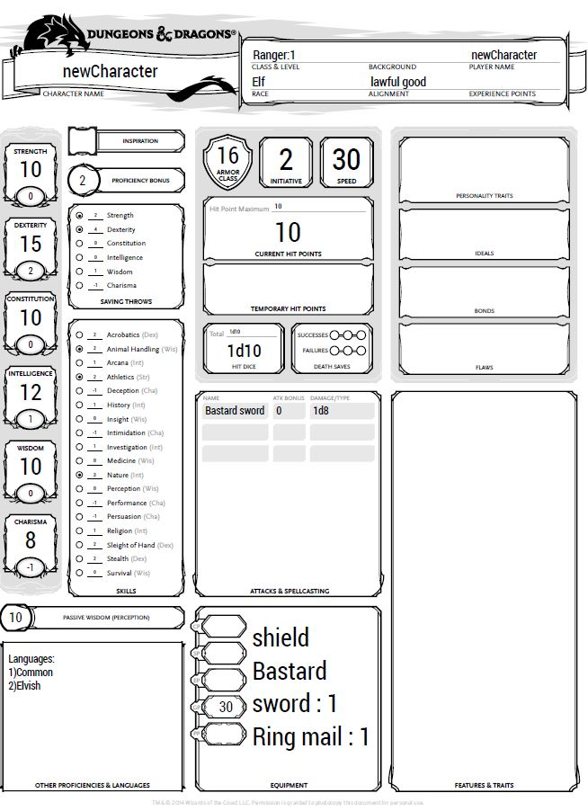
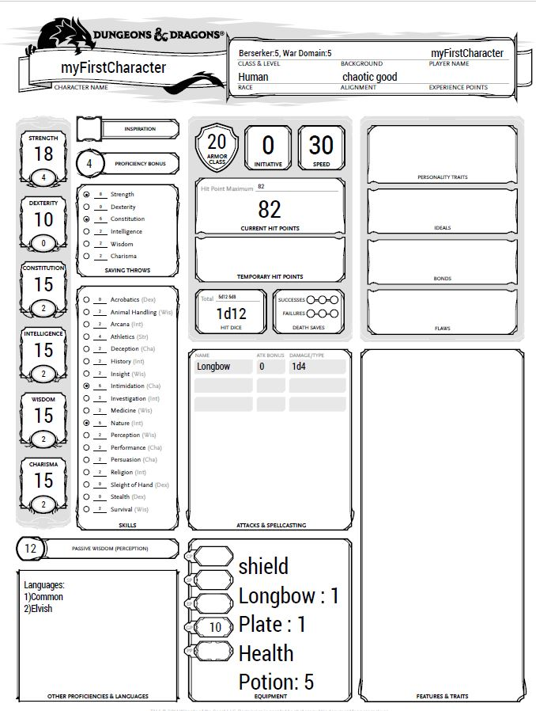

# Additional instructions
1. [Importing from other files](#import)
2. [Importing example](#importExample)
2. [Comments](#comm)

## Importing from other files <a name = "import"/>
It is possible to import characters and equipment from files in the same 
folder of the processed file. The syntax is the following:
        
         import <equipName> from <fileName>
         import <characterName> from <fileName>

As shown in the syntax of the command, it is possible to import 1 character or equipement per import statement.
An imported character or equipment cannot have the same name of an entity of the same type
in the destination file.

## Importing example <a name= "importExample"/>

Suppose the following folder structure:

        .
        +-- D_Automatic_Charsheet_Compiler.jar
        +-- importExample.ddm
        +-- equipLib.ddm
        +-- charLib.ddm

This is the code inside equipLib.ddm :
        
        create Equipment heavyEquip{
            armor:Plate
            shield:Yes
            consumables:(Health potion*5,Gold*10)
            weapon:Longbow
        }
        
        create Equipment additionalEquip{
            armor:Half plate
            shield:No
            consumables:(Health potion*5,Gold*10,Gold*25)
            weapon:Dagger
        }

This is the code inside charLib.ddm :

        create Player additionalCharacter{
            race: Half Orc
            hp:100
            archetype: (Barbarian->Berserker)
            abilities:(20,14,17,9,9,8)
            alignment:chaotic evil
            skills: (Intimidation,Animal Handling)
            languages: ()
        }
        
        create Player newCharacter{
            race: Elf
            hp:10
            archetype: (Ranger)
            abilities:(10,15,10,12,10,8)
            alignment:lawful good
            skills: (Animal Handling,Athletics,Nature)
            languages: ()
        }

This is the code inside importExample.ddm :

        import newCharacter from charLib
        import heavyEquip from equipLib
        
        create Player myFirstCharacter{
            race: Human
            hp:82
            archetype: (Barbarian->Berserker,Cleric->War Domain)
            abilities:(18,10,15,15,15,15)
            alignment:chaotic good
            skills: (Intimidation,Nature)
            languages: (Elvish)
        }
        
        set Level of Barbarian for myFirstCharacter = 5
        set Level of Cleric for myFirstCharacter = 5
        
        set Level of Ranger for newCharacter = 1
        
        create Equipment newEquip{
            armor:Ring mail
            shield:Yes
            consumables:(Gold*30)
            weapon:Bastard sword
        }
        
        set Items for newCharacter = newEquip
        set Active Equipment for newCharacter = newEquip
        
        set Active Equipment for myFirstCharacter = heavyEquip
        set Items for myFirstCharacter = heavyEquip
        
The following PDF are the results:

 
   

        

## Comments <a name = "import"/>
It is possible to write comment using the following syntax for 1 line comment:

        // comment
        
Or this syntax for multi line comment:

        /* 
           comment 1
           comment 2
        */
