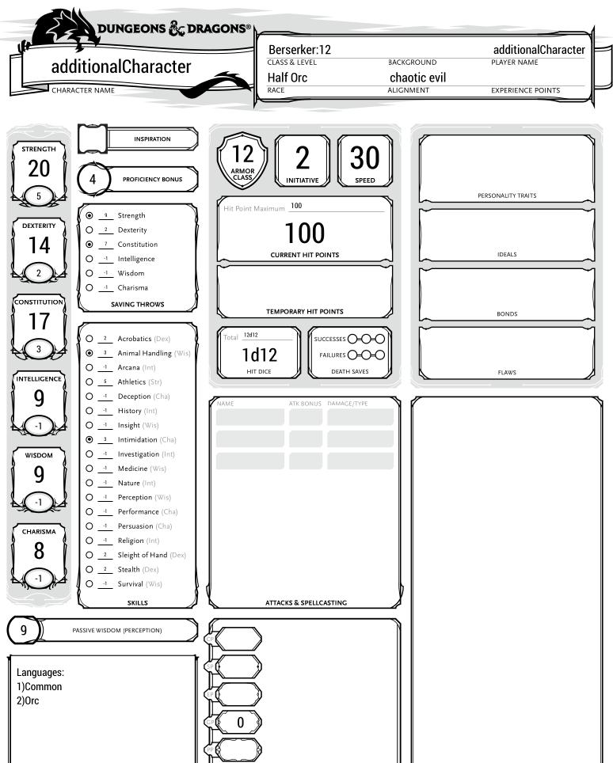

# Definition of multiple characters
1. [Create multiple character](#multiCre)
2. [Important note](#notes)
3. [Setting the same equipment on multiple characters](#same)
## Create multiple character<a name = "multiCre"/>
The DDM language supports the definition of multiple characters inside a
single .ddm or .txt file. 
Creating additional characters follows this procedure:

        create Player myFirstCharacter{
            race: Human
            hp:82
            archetype: (Barbarian->Berserker,Cleric->War Domain)
            abilities:(18,10,15,15,15,15)
            alignment:chaotic good
            skills: (Intimidation,Nature)
            languages: (Elvish)
        }
        
        
        set Level of Barbarian for myFirstCharacter = 5
        set Level of Cleric for myFirstCharacter = 5
        
        create Player additionalCharacter{
            race: Half Orc
            hp:100
            archetype: (Barbarian->Berserker)
            abilities:(20,14,17,9,9,8)
            alignment:chaotic evil
            skills: (Intimidation,Animal Handling)
            languages: ()
        }
        
        set Level of Barbarian for additionalCharacter = 12
        
After executing the command:

        java -jar D_Automatic_Charsheet_Compiler.jar singleChar.ddm

The folder structure will be the following:

        .
        +-- D_Automatic_Charsheet_Compiler.jar
        +-- singleChar.ddm
        +-- outputs
            +-- myFirstCharacter.pdf
            +-- additionalCharacter.pdf 

The resulting 'additionalCharacter.pdf':

         

## Important note <a name = "notes"/>
When defining more than one character is important that every character name is different. Is there are character with the same
name the .ddm won't be valid.

### Setting the same equipment on multiple characters <a name = "same"/>
The language permits this action: the [Items setting](./settings.md#items) can be used for the same
equipment on multiple characters, in order to avoid having multiple equipment with the same name.
The following code is therefore valid:<a name = "fourDef"/>
        
        //First character definition
        create Player myFirstCharacter{
            race: Human
            hp:82
            archetype: (Barbarian->Berserker,Cleric->War Domain)
            abilities:(18,10,15,15,15,15)
            alignment:chaotic good
            skills: (Intimidation,Nature)
            languages: (Elvish)
        }
        
        //Level settings
        set Level of Barbarian for myFirstCharacter = 5
        set Level of Cleric for myFirstCharacter = 5
        
        //Second character definition
        create Player additionalCharacter{
            race: Half Orc
            hp:100
            archetype: (Barbarian->Berserker)
            abilities:(20,14,17,9,9,8)
            alignment:chaotic evil
            skills: (Intimidation,Animal Handling)
            languages: ()
        }
        
        //Level setting
        set Level of Barbarian for additionalCharacter = 12
        
        //Equipment creation
        create Equipment heavyEquip{
            armor:Plate
            shield:Yes
            consumables:(Health potion*5,Gold*10)
            weapon:Longbow
        }
        
        
        //Set the equipment for both character and activate it
        set Items for myFirstCharacter = heavyEquip
        set Active Equipment for myFirstCharacter = heavyEquip
        
        set Items for additionalCharacter = heavyEquip
        set Active Equipment for additionalCharacter = heavyEquip

        
This is the 'additionalCharacter.pdf' produced:

  