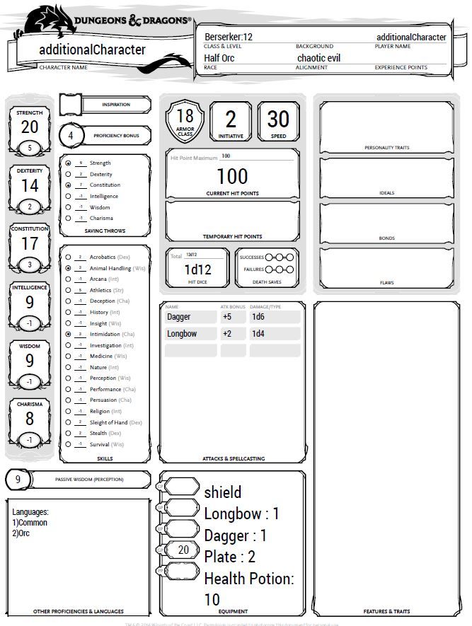

# Definition of multiple equipment
1. [Create multiple equipment](#multiCrea)

## Create multiple equipment
This tool is also capable of creating multiple equipment inside
the same .ddm file. In a similar way to what has been shown to create 
multiple character, it is possible to add  multiple equipment entry.
We can modify [this code](mulChar.md#fourDef) as follows:

        //First character definition
            create Player myFirstCharacter{
                race: Human
                hp:82
                archetype: (Barbarian->Berserker,Cleric->War Domain)
                abilities:(18,10,15,15,15,15)
                alignment:chaotic good
                skills: (Intimidation,Nature)
                languages: (Elvish)
            }
        
            //Level settings
            set Level of Barbarian for myFirstCharacter = 5
            set Level of Cleric for myFirstCharacter = 5
        
            //Second character definition
            create Player additionalCharacter{
                race: Half Orc
                hp:100
                archetype: (Barbarian->Berserker)
                abilities:(20,14,17,9,9,8)
                alignment:chaotic evil
                skills: (Intimidation,Animal Handling)
                languages: ()
            }
        
            //Level setting
            set Level of Barbarian for additionalCharacter = 12
        
            //First Equipment creation
            create Equipment heavyEquip{
                armor:Plate
                shield:Yes
                consumables:(Health potion*5,Gold*10)
                weapon:Longbow
            }
            //Second Equipment creation
            create Equipment additionalEquip{
                armor:Plate
                shield:No
                consumables:(Health potion*5,Gold*10)
                weapon:Dagger
            }
        
        
            //Set the equipment for both character and activate it
            set Items for myFirstCharacter = heavyEquip
            set Active Equipment for myFirstCharacter = heavyEquip
        
            set Items for additionalCharacter = heavyEquip
            set Items for additionalCharacter = additionalEquip
            set Active Equipment for additionalCharacter = additionalEquip

Producing the following 'additionalCharacter.pdf':

 
