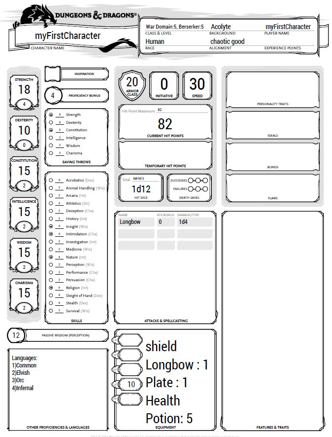
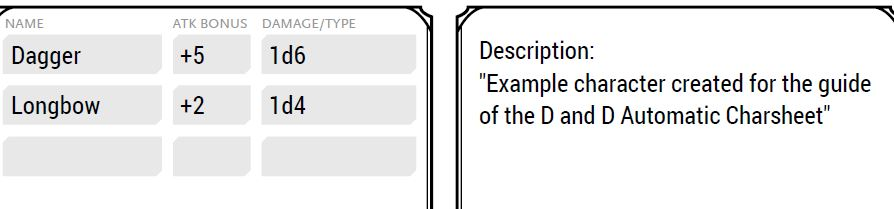

# Set properties
1. [Description setting](#desc) 
2. [Level setting](#level)
3. [Background setting](#bg)
4. [Item setting](#items)
5. [Active Equipment setting](#active)
6. [Example for Background setting](#bgExample)
7. [Example for Description setting](#DescriptionExample)
## Description setting <a name = "desc"/>
Optional setting: add the description of the character inside the
charseet. Syntax:

        set Description for <nameCharacter> = "<Description>"

The description cannot be longer than 250 characters.

## Level setting <a name = "level"/>
Mandatory setting. Every character must have one of these for every class.

        set Level of <mainClass> for <nameCharacter> = <level>
Level cannot be higher of 20. The sum of all levels of a character cannot be higher of 20.

## Background setting <a name = "bg"/>
Optional setting: add the character's background and set all the skill proficiencies.

        set Background for <nameCharacter> = <background>
        
## Item setting <a name = "items" />
Optional setting: add the specified equipment to the character's inventory.

        set Items for <nameCharacter> = <nameEquipment>

## Active Equipment setting <a name = "active"/>
Optional setting: activate the specified equipment for the character.

        set Active Equipment for <nameCharacter> = <nameEquipment>
Only equipment with an Item setting can be activated.

## Example for Background setting <a name = "bgExample"/>
'myFirstCharacter.pdf' after setting the 'Acolyte' background:

## Example for Description setting <a name = "DescriptionExample"/>
'additionalCharacter.pdf' after setting the description:

